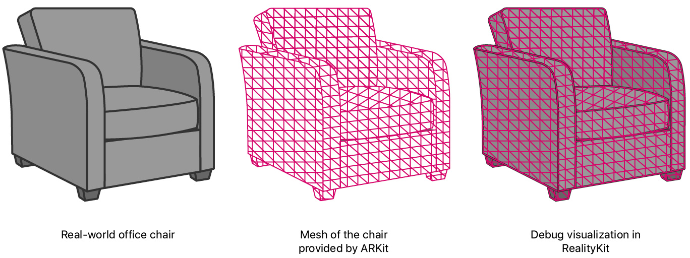
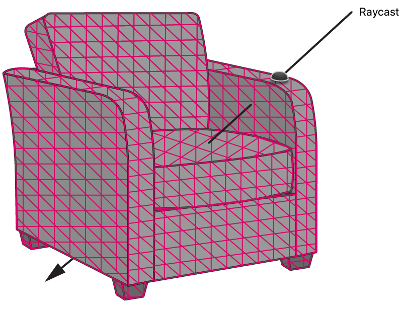
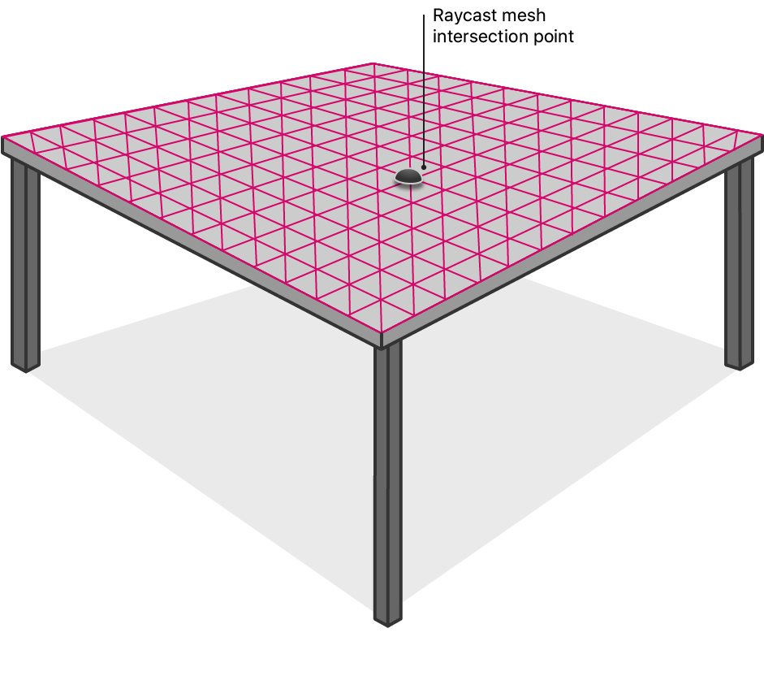
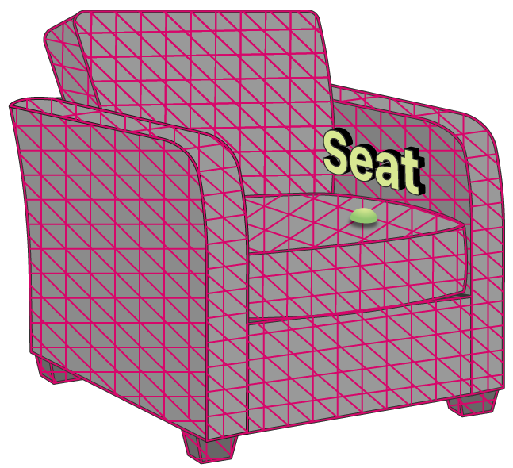
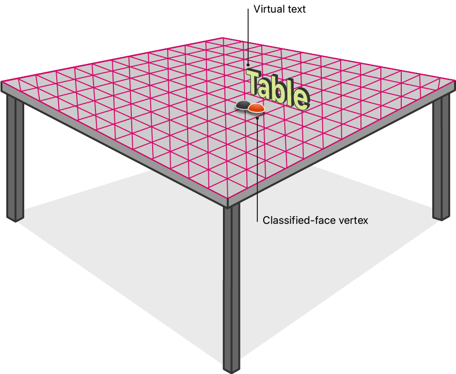
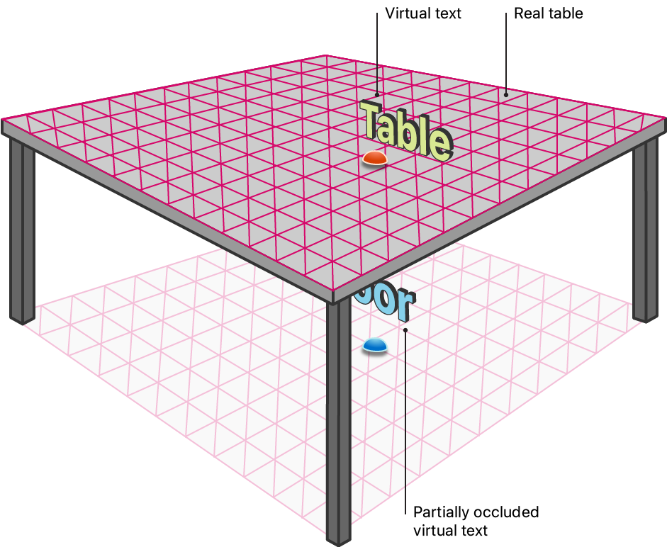
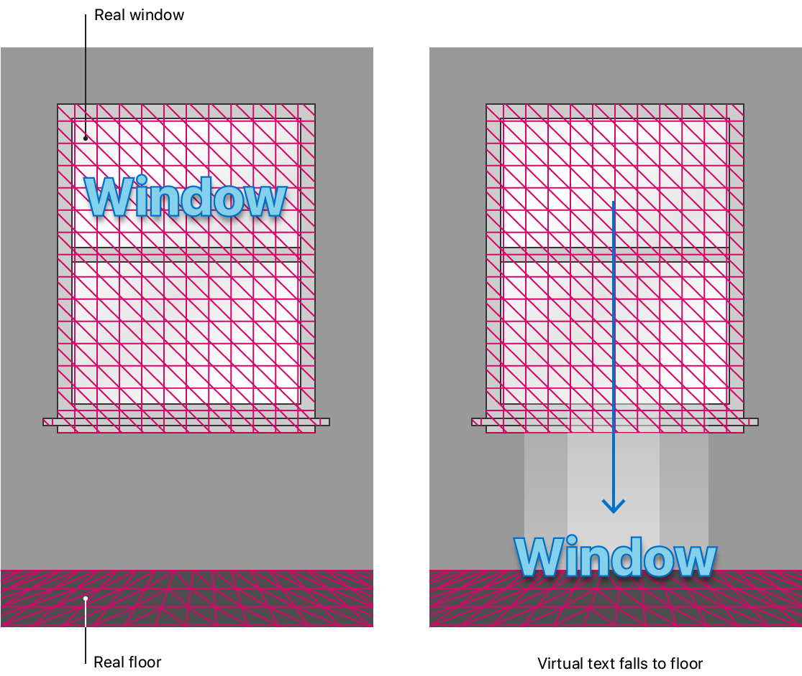

# 3DScan-Classify-ExportOBJ

ポリゴンメッシュを使用して物理環境の形状を推定し，objファイルを出力するシステムです．

## 概要

このシステムはiPadに搭載されているLiDARとカメラを用いて物理環境の形状を推定し，objファイル(3DCGで用いる物体の形状データを記録する形式)を出力するシステムです．つまり現実の空間やオブジェクト(物体)を3Dスキャンし，スキャンデータをobjファイルとして出力します．またスキャン時に現実成果の(7種類の)オブジェクトを分類することができ，iPad上でそのオブジェクトのポリゴンをタップすると分類結果テキストが仮想オブジェクトとして表示されます．objファイルは全てのポリゴンを含んだものと分類ごとのポリゴンを含んだものが出力される(出力例は〜にあります)．
このシステムはAppleが提供している「[VisualizingAndInteractingWithAReconstructedScene](https://developer.apple.com/jp/documentation/arkit/world_tracking/visualizing_and_interacting_with_a_reconstructed_scene/)」をベースにして開発を行いました．私が開発した部分は主にobjファイルの出力と


iPad OS 13.4以降を搭載した第4世代iPad Proでは、ARKitはLiDARスキャナーを使用して物理環境のポリゴンモデルを作成します。LiDARスキャナは、ユーザーの前方の広範囲から奥行き情報をすばやく取得するため、ARKitはユーザーが移動することなく現実世界の形状を推定できます。ARKitは、奥行き情報を一連の頂点に変換し、その頂点をつなげて*メッシュ*を形成します。情報を分割するために、ARKitは複数のアンカーを作成し、それぞれにメッシュの一意の部分を割り当てます。メッシュのアンカーを総称して、ユーザーの周りの現実世界の*シーン*を表します。

これらのメッシュを使用すると、次のことが可能になります：
* 現実世界のサーフェス上のポイントをより正確に特定する。
* ARKitが認識できる現実世界のオブジェクトを分類します。
* アプリの仮想コンテンツを、その前にある現実世界のオブジェクトでオクルードする。
* 例えば、仮想のボールを現実世界の壁でバウンドさせ、ボールを物理法則に従わせるなど、仮想コンテンツが物理環境とリアルに相互作用します。

このサンプルアプリでは、RealityKitを使ったAR体験を紹介しています。下図は、RealityKitがARKitから現実世界の情報を取得し、このアプリを実行して現実世界の椅子にデバイスを向けると、デバッグ用のビジュアライゼーションが作成される様子を示しています。

RealityKitで可視化されたメッシュ・オーバーレイがカメラ・フィードに表示された椅子のスクリーンショット](Documentation/meshing3-annotated.png)


www.DeepL.com/Translator（無料版）で翻訳しました。

With these meshes, you can:
* More accurately locate points on real-world surfaces.
* Classify real-world objects that ARKit can recognize.
* Occlude your app’s virtual content with real-world objects that are in front of it.
* Have virtual content interact with the physical environment realistically, for example, by bouncing a virtual ball off a real-world wall and having the ball follow the laws of physics. 

This sample app presents an AR experience using RealityKit. The figure below illustrates how RealityKit leverages real-world information from ARKit, and creates a debug visualization when you run this app and point the device at a real-world chair.



## Visualize the Shape of the Physical Environment

To enable scene meshes, the sample sets a world-configuration's [`sceneReconstruction`][12] property to one of the mesh options.

``` swift
arView.automaticallyConfigureSession = false
let configuration = ARWorldTrackingConfiguration()
configuration.sceneReconstruction = .meshWithClassification
```

The sample uses RealityKit's [`ARView`][10] to render its graphics. To visualize meshes at runtime, [`ARView`][10] offers the [`.showSceneUnderstanding`][13] debugging option.

``` swift
arView.debugOptions.insert(.showSceneUnderstanding)
```

- Note: The sample enables mesh visualization only to demonstrate the mesh feature; similarly, you normally enable mesh visualization only for debugging purposes.

To begin the AR experience, the sample configures and runs the session when the app first starts, in the main view controller's [`viewDidLoad`](x-source-tag://viewDidLoad) callback. 

``` swift
arView.session.run(configuration)
```

## Add Plane Detection

When an app enables plane detection with scene reconstruction, ARKit considers that information when making the mesh. Where the LiDAR scanner may produce a slightly uneven mesh on a real-world surface, ARKit smooths out the mesh where it detects a plane on that surface. 

To demonstrate the difference that plane detection makes on meshes, this app displays a toggle button. In the button handler, the sample adjusts the plane-detection configuration and restarts the session to effect the change.

``` swift
@IBAction func togglePlaneDetectionButtonPressed(_ button: UIButton) {
    guard let configuration = arView.session.configuration as? ARWorldTrackingConfiguration else {
        return
    }
    if configuration.planeDetection == [] {
        configuration.planeDetection = [.horizontal, .vertical]
        button.setTitle("Stop Plane Detection", for: [])
    } else {
        configuration.planeDetection = []
        button.setTitle("Start Plane Detection", for: [])
    }
    arView.session.run(configuration)
}
```
[View in Source](x-source-tag://TogglePlaneDetection)

## Locate a Point on an Object's Surface

Apps that retrieve surface locations using meshes can achieve unprecedented accuracy. By considering the mesh, raycasts can intersect with nonplanar surfaces, or surfaces with little or no features, like white walls. 

To demonstrate accurate raycast results, this app casts a ray when the user taps the screen. The sample specifies the [`.estimatedPlane`][9] allowable-target, and [`.any`][8] alignment option, as required to retrieve a point on a meshed, real-world object.

``` swift
let tapLocation = sender.location(in: arView)
if let result = arView.raycast(from: tapLocation, allowing: .estimatedPlane, alignment: .any).first {
    // ...
```



When the user's raycast returns a result, this app gives visual feedback by placing a small sphere at the intersection point. 

``` swift
let resultAnchor = AnchorEntity(world: result.worldTransform)
resultAnchor.addChild(sphere(radius: 0.01, color: .lightGray))
arView.scene.addAnchor(resultAnchor, removeAfter: 3)
```



## Classify Real-World Objects

ARKit has a classification feature that analyzes its meshed model of the world to recognize specific, real-world objects. Within the mesh, ARKit can classify floors, tables, seats, windows, and ceilings. See [`ARMeshClassification`][11] for the full list.

If the user taps the screen and the raycast intersects with a meshed, real-world object, this app displays text of the mesh's classification. 



When the [`automaticallyConfigureSession`][3] property of [`ARView`][10] is `true`, RealityKit disables classification by default because it isn’t required for occlusion and physics. To enable mesh classification, the sample overrides the default by setting the [`sceneReconstruction`][12] property to [`.meshWithClassification`][16].

``` swift
arView.automaticallyConfigureSession = false
let configuration = ARWorldTrackingConfiguration()
configuration.sceneReconstruction = .meshWithClassification
```

This app attempts to retrieve a classification for the intersection point from the mesh.

``` swift
nearbyFaceWithClassification(to: result.worldTransform.position) { (centerOfFace, classification) in
    // ...
```

Every three vertices in the mesh form a triangle, called a *face.* ARKit assigns a classification for each face, so the sample searches through the mesh for a face near the intersection point. If the face has a classification, this app displays it on screen. Because this routine involves extensive processing, the sample does the work asynchronously, so the renderer does not stall.

``` swift
DispatchQueue.global().async {
    for anchor in meshAnchors {
        for index in 0..<anchor.geometry.faces.count {
            // Get the center of the face so that we can compare it to the given location.
            let geometricCenterOfFace = anchor.geometry.centerOf(faceWithIndex: index)
            
            // Convert the face's center to world coordinates.
            var centerLocalTransform = matrix_identity_float4x4
            centerLocalTransform.columns.3 = SIMD4<Float>(geometricCenterOfFace.0, geometricCenterOfFace.1, geometricCenterOfFace.2, 1)
            let centerWorldPosition = (anchor.transform * centerLocalTransform).position
             
            // We're interested in a classification that is sufficiently close to the given location––within 5 cm.
            let distanceToFace = distance(centerWorldPosition, location)
            if distanceToFace <= 0.05 {
                // Get the semantic classification of the face and finish the search.
                let classification: ARMeshClassification = anchor.geometry.classificationOf(faceWithIndex: index)
                completionBlock(centerWorldPosition, classification)
                return
            }
        }
    }
```

With the classification in-hand, the sample creates 3D text to display it.

``` swift
let textEntity = self.model(for: classification)
```

To prevent the mesh from partially occluding the text, the sample offsets the text slightly to help readability. The sample calculates the offset in the negative direction of the ray, which effectively moves the text slightly toward the camera, which is away from the surface. 

``` swift
let rayDirection = normalize(result.worldTransform.position - self.arView.cameraTransform.translation)
let textPositionInWorldCoordinates = result.worldTransform.position - (rayDirection * 0.1)
```

To make the text always appear the same size on screen, the sample applies a scale based on text's distance from the camera.

``` swift
let raycastDistance = distance(result.worldTransform.position, self.arView.cameraTransform.translation)
textEntity.scale = .one * raycastDistance
```

To display the text, the sample puts it in an anchored entity at the adjusted intersection-point, which is oriented to face the camera. 

``` swift
var resultWithCameraOrientation = self.arView.cameraTransform
resultWithCameraOrientation.translation = textPositionInWorldCoordinates
let textAnchor = AnchorEntity(world: resultWithCameraOrientation.matrix)
textAnchor.addChild(textEntity)
self.arView.scene.addAnchor(textAnchor, removeAfter: 3)
```

To visualize the location of the face's vertex from which the classification was retrieved, the sample creates a small sphere at the vertex's real-world position.

``` swift
if let centerOfFace = centerOfFace {
    let faceAnchor = AnchorEntity(world: centerOfFace)
    faceAnchor.addChild(self.sphere(radius: 0.01, color: classification.color))
    self.arView.scene.addAnchor(faceAnchor, removeAfter: 3)
}
```



## Occlude Virtual Content with a Mesh

*Occlusion* is a feature where parts of the real world cover an app's virtual content, from the camera's perspective. To achieve this illusion, RealityKit checks for any meshes in front of virtual content, viewed by the user, and omits drawing any part of the virtual content obscured by those meshes. The sample enables occlusion by adding the [`.occlusion`][14] option to the environment's [`sceneUnderstanding`][13] property.

``` swift
arView.environment.sceneUnderstanding.options.insert(.occlusion)
```

At runtime, this app omits drawing portions of the virtual text that are behind any part of the meshed, real world. 



## Interact with Real-World Objects Using Physics

With scene meshes, virtual content can interact with the physical environment realistically because the meshes give RealityKit's physics engine an accurate model of the world. The sample enables physics by adding the [`.physics`][15] option to the environment's [`sceneUnderstanding`][13] property.

``` swift
arView.environment.sceneUnderstanding.options.insert(.physics)
```

To detect when virtual content comes in contact with a meshed, real-world object, the sample defines the text's proportions using a collision shape in the [`addAnchor(_:,removeAfter:)`](x-source-tag://AddAnchorExtension) [`Scene`][7] extension.

``` swift
if model.collision == nil {
    model.generateCollisionShapes(recursive: true)
    model.physicsBody = .init()
}
```

When this app classifies an object and displays some text, it waits three seconds before dropping the virtual text. When the sample sets the text's [`physicsBody`][4]'s [`mode`][5] to [`.dynamic`][6], the text reacts to gravity by falling.

``` swift
Timer.scheduledTimer(withTimeInterval: seconds, repeats: false) { (timer) in
    model.physicsBody?.mode = .dynamic
}
```

As the text falls, it reacts when colliding with a meshed, real-world object, such as landing on the floor.



[1]:https://developer.apple.com/documentation/arkit/arhittestresult/resulttype/2887460-estimatedhorizontalplane
[2]:https://developer.apple.com/documentation/arkit/arhittestresult/resulttype/2887455-estimatedverticalplane
[3]:https://developer.apple.com/documentation/realitykit/arview/3340491-automaticallyconfiguresession
[4]:https://developer.apple.com/documentation/realitykit/modelentity/3244500-physicsbody
[5]:https://developer.apple.com/documentation/realitykit/physicsbodycomponent/3244762-mode
[6]:https://developer.apple.com/documentation/realitykit/physicsbodymode/dynamic
[7]:https://developer.apple.com/documentation/realitykit/scene
[8]:https://developer.apple.com/documentation/arkit/arraycastquery/targetalignment/any
[9]:https://developer.apple.com/documentation/arkit/arraycastquery/target/estimatedplane
[10]:https://developer.apple.com/documentation/realitykit/arview
[11]:https://developer.apple.com/documentation/arkit/armeshclassification
[12]:https://developer.apple.com/documentation/arkit/arworldtrackingconfiguration/3521376-scenereconstruction
[13]:https://developer.apple.com/documentation/realitykit/arview/environment/3521451-sceneunderstanding
[14]:https://developer.apple.com/documentation/realitykit/arview/environment/sceneunderstanding/options/3521434-occlusion
[15]:https://developer.apple.com/documentation/realitykit/arview/environment/sceneunderstanding/options/3521435-physics
[16]:https://developer.apple.com/documentation/arkit/arconfiguration/scenereconstruction/3521373-meshwithclassification
